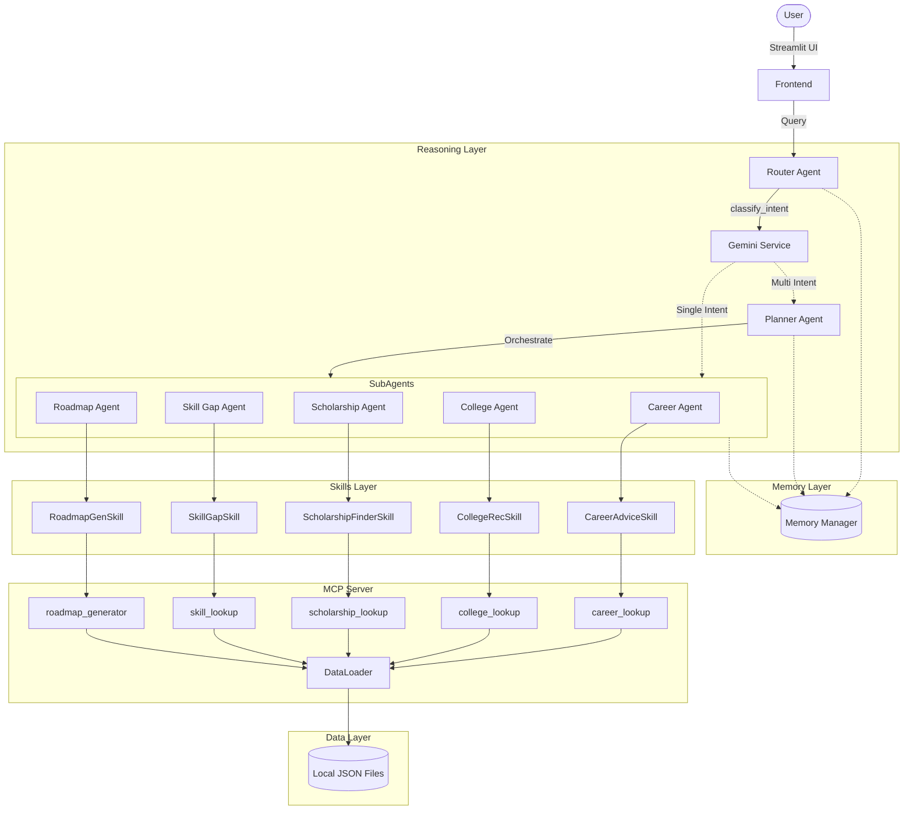

# Vidya AI Architecture

## Overview

Vidya AI implements a **multi-agent orchestration pattern** using Google ADK and Gemini.

## Key Components

1. **Router Agent**: Gating mechanism. Performs language translation, input sanitization, and intent classification via Gemini structured output. Routes simple queries directly to a sub-agent, and complex queries to the Planner.
2. **Planner Agent**: For queries with multiple intents (e.g. "I want to be an AI Engineer and need scholarships"), it generates an execution plan, runs agents sequentially, and uses Gemini to synthesize a single coherent response.
3. **ADK Skills**: Decouples business logic from agents. Skills handle data fetching and formatting.
4. **MCP Server**: A FastAPI server that exposes both local JSON data tools and dynamic Gemini-powered tools (Google Custom Search integration).
5. **Memory Manager**: A thread-safe, file-based persistence layer storing student profiles (interests, marks, language preference) and conversation history. Works seamlessly across Streamlit's execution model.
