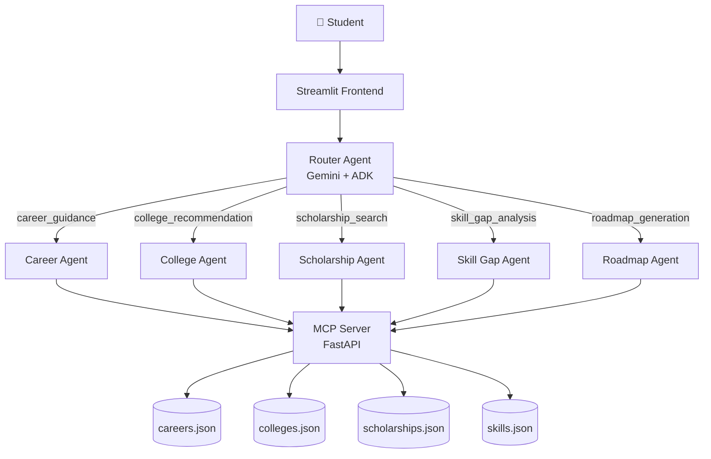

# Vidya AI – Multi-Agent Career & Education Mentor

## Overview

Build a complete, production-ready **Vidya AI** system in `k:\PROJECTS\Vidya-multiagent\` — a multi-agent AI platform that helps Indian students (post-10th, 12th, Diploma, UG, PG) discover careers, find colleges, locate scholarships, analyze skill gaps, and generate learning roadmaps. Fully bilingual (English + Malayalam), powered by Google ADK + Gemini, with a Streamlit frontend and an MCP server exposing all data-lookup tools.

---

## Proposed Changes

### Project Root

#### [NEW] `.env.example`
API key template (GEMINI_API_KEY, MCP_SERVER_URL, etc.).

#### [NEW] `requirements.txt`
All Python dependencies: `google-adk`, `google-genai`, `streamlit`, `fastapi`, `uvicorn`, `pydantic`, `python-dotenv`, `langdetect`, `httpx`, `pytest`, `pytest-cov`, `mcp`.

#### [NEW] `Dockerfile` + `docker-compose.yml`
Multi-service setup: MCP server (FastAPI/uvicorn) + Streamlit frontend.

#### [NEW] `pyproject.toml`
Package config with `[project]` and `[tool.pytest.ini_options]`.

---

### Data Layer — `data/`

#### [NEW] `data/careers.json`
30+ careers with: `id`, `career_name`, `description`, `salary_range`, `required_skills[]`, `future_demand`, `education_path`, `category` (STEM / Arts / Commerce / Health / Law).

#### [NEW] `data/colleges.json`
50+ colleges across Kerala, TN, Karnataka, Maharashtra with: `id`, `college_name`, `state`, `courses[]`, `fees`, `ranking`, `type` (Government/Private/Deemed), `eligibility`, `website`.

#### [NEW] `data/scholarships.json`
30+ scholarships with: `id`, `name`, `eligibility`, `amount`, `deadline`, `category` (SC/ST/OBC/Merit/Girl), `website`.

#### [NEW] `data/skills.json`
Skill taxonomy: `skill_name`, `category`, `learning_resources[]`, `related_careers[]`.

---

### MCP Server — `mcp_server/`

#### [NEW] `mcp_server/server.py`
FastAPI + MCP-compatible server exposing 5 tools as HTTP endpoints and MCP protocol.

#### [NEW] `mcp_server/tools.py`
Tool implementations:
- `career_lookup(query, category)` — fuzzy search over careers.json
- `college_lookup(state, course, marks)` — filter colleges.json
- `scholarship_lookup(eligibility_category, state)` — filter scholarships.json
- `skill_lookup(career_name)` — get required skills for a career
- `roadmap_generator(career_name, current_skills, duration_months)` — generate step-by-step roadmap

#### [NEW] `mcp_server/config.py`
Server config (host, port, CORS origins).

---

### Agents — `agents/`

#### [NEW] `agents/router_agent.py`
Google ADK `Agent` that:
- Detects language (English/Malayalam) via `langdetect`
- Classifies intent: `career_guidance | college_recommendation | scholarship_search | skill_gap_analysis | roadmap_generation | general_help`
- Routes to appropriate sub-agent using ADK `sub_agents` or tool-call dispatch

#### [NEW] `agents/career_agent.py`
ADK `Agent` using `career_lookup` MCP tool. Returns structured career recommendations with roles, salary, demand, and educational paths.

#### [NEW] `agents/college_agent.py`
ADK `Agent` using `college_lookup` MCP tool. Filters by state, marks, and course preference.

#### [NEW] `agents/scholarship_agent.py`
ADK `Agent` using `scholarship_lookup` MCP tool. Returns eligibility, deadlines, and application links.

#### [NEW] `agents/skill_gap_agent.py`
ADK `Agent` comparing current skills vs. target career required skills using `skill_lookup`.

#### [NEW] `agents/roadmap_agent.py`
ADK `Agent` using `roadmap_generator` to produce monthly milestone plans.

#### [NEW] `agents/__init__.py`
Exports all agents, wires up ADK orchestration.

---

### Utils — `utils/`

#### [NEW] `utils/language.py`
`detect_language(text) -> "en" | "ml"` + translation helpers using Gemini.

#### [NEW] `utils/security.py`
Input sanitizer, prompt injection detector, content filter (keyword + Gemini safety settings).

#### [NEW] `utils/data_loader.py`
JSON dataset loader with caching and Pydantic validation.

#### [NEW] `utils/pydantic_models.py`
Pydantic models: `CareerResult`, `CollegeResult`, `ScholarshipResult`, `RoadmapStep`, `AgentResponse`.

---

### Frontend — `frontend/`

#### [NEW] `frontend/app.py`
Streamlit multi-page app with custom CSS theme (deep blue + gold, glassmorphism, Inter font).

Sidebar navigation to:
- 🏠 Home
- 💬 Chat Assistant
- 🎯 Career Explorer
- 🏫 College Finder
- 🎓 Scholarships
- 📊 Skill Gap Analyzer
- ℹ️ About

#### [NEW] `frontend/pages/1_Chat_Assistant.py`
Full chat UI with:
- Message history with agent avatars
- Language toggle (EN/ML)
- Agent status badge showing which sub-agent responded
- Loading spinner animation

#### [NEW] `frontend/pages/2_Career_Explorer.py`
Search + filter UI for careers with:
- Cards with salary badges, demand indicators, skill tags
- Expandable details with education path timeline

#### [NEW] `frontend/pages/3_College_Finder.py`
Filter form (state, marks, course) → ranked college cards with fee, type badge, eligibility info.

#### [NEW] `frontend/pages/4_Scholarships.py`
Scholarship browser with eligibility filters, deadline countdown badges, application links.

#### [NEW] `frontend/pages/5_Skill_Gap_Analyzer.py`
- Current skills input (multi-select)
- Target career picker
- Visual gap analysis: progress bar per skill
- Roadmap timeline visualization

#### [NEW] `frontend/pages/6_About.py`
Project info, architecture diagram (Mermaid), team, and hackathon context.

#### [NEW] `frontend/styles/theme.css`
Custom Streamlit CSS: dark blue background, gold accents, glassmorphism cards, smooth transitions.

---

### Tests — `tests/`

#### [NEW] `tests/test_mcp_tools.py`
Unit tests for all 5 MCP tool functions (career, college, scholarship, skill, roadmap).

#### [NEW] `tests/test_data_loader.py`
Validates JSON dataset structure and Pydantic model parsing.

#### [NEW] `tests/test_security.py`
Tests for prompt injection detection, content filtering, input validation.

#### [NEW] `tests/test_language.py`
Tests for Malayalam/English language detection.

#### [NEW] `tests/test_router.py`
Integration tests for intent classification (mocked Gemini).

#### [NEW] `tests/conftest.py`
Shared pytest fixtures (sample data, mock MCP client).

---

### Docs — `docs/`

#### [NEW] `docs/architecture.md`
Mermaid diagrams: system overview, agent flow, MCP tool interaction, data flow.

#### [NEW] `docs/deployment.md`
Deployment guides for Streamlit Community Cloud, Render, Docker.

---

### Root Files

#### [MODIFY] `README.md`
Full rewrite: project overview, architecture diagram, setup instructions, agent flow, screenshots placeholder, deployment.

---

## Architecture Overview



---

## Tech Stack

| Layer | Technology |
|---|---|
| Agent Framework | Google ADK (google-adk) |
| LLM | Gemini 1.5 Flash (via google-genai) |
| MCP Server | FastAPI + MCP Python SDK |
| Frontend | Streamlit with custom CSS |
| Data Validation | Pydantic v2 |
| Language Detection | langdetect |
| Testing | pytest + pytest-cov |
| Containerization | Docker + docker-compose |

---

## Verification Plan

### Automated Tests
```bash
pytest tests/ -v --cov=. --cov-report=term-missing
```
Target: ≥80% coverage on utils and mcp_server modules.

### Manual Verification
1. Start MCP server: `uvicorn mcp_server.server:app --port 8000`
2. Start Streamlit: `streamlit run frontend/app.py`
3. Test chat with: "I love mathematics and AI" → should route to Career Agent
4. Test Malayalam: "എനിക്ക് AI Engineer ആകണം" → should respond in Malayalam
5. Test college finder with state=Kerala, marks=85, course=Engineering
6. Test scholarship search with category=SC
